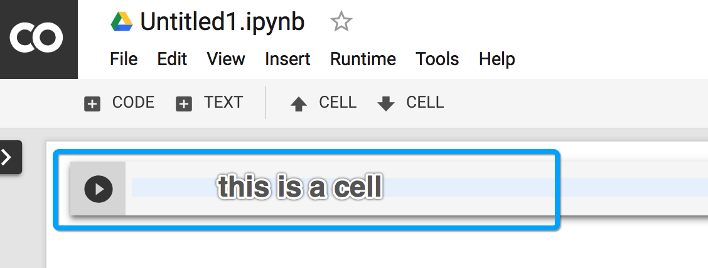
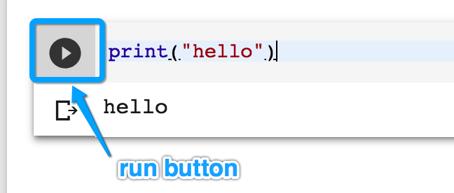
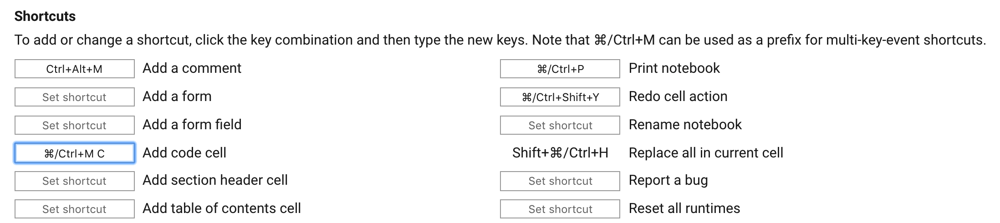
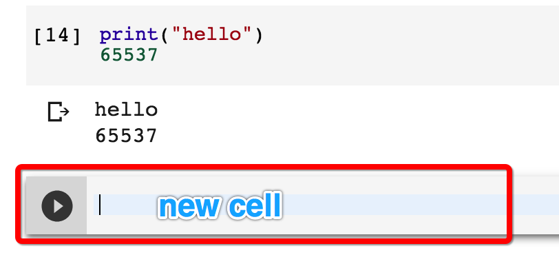

  On Windows, instead of <kbd>cmd</kbd> key, use <kbd>ctrl</kbd> key  
* Go to https://colab.research.google.com  
  This is a programming environment called Colab.  
  It will be your primary tool throughout the course.  
  It requires a google account, so you will be asked to login.  
  If you do not have a google account, please create one first.  
---
* Create an empty notebook  
    
     
  A notebook is a collection of programming instructions.  
  It contains one or more cells.  
  Each cell contains one or more lines of code.  
    
---
* Enter `print("hello")` into the cell  
* **run the cell** by clicking the run button or by pressing <kbd>cmd</kbd> + <kbd>Enter</kbd>  
  Note: to **run the cell** means to execute the code in the cell.
  Your output should look as follows:  
    
  You have just performed a **function call**!  
  Function call looks like this: `function_name(argument1, argument2, ..., argumentN)`  
  Your function name is `print` and there is one argument - a string of characters `"hello"`  
  `print()` is a python function that prints its argument so we can observe the output on the screen  
* Delete all code, write `"hello"` and press <kbd>cmd</kbd> + <kbd>Enter</kbd>  
  Notice that although you don't use the `print()` function, you can still see the argument  
  This is how Colab works, it always prints result of the last line in each cell  
* See it for yourself: under `"hello"` write a new line: `65537`, press <kbd>cmd</kbd> + <kbd>Enter</kbd>  
* Change `"hello"` into `print("hello")`, press <kbd>cmd</kbd> + <kbd>Enter</kbd>  
---
* When programming, it is very useful to know keyboard shortcuts in your tools
* Open **Keyboard Shortcuts** by pressing <kbd>cmd</kbd> + <kbd>M</kbd> then <kbd>H</kbd>
* Browse for 'Add code cell', click on the input box
* When the box is highlighted in blue, press <kbd>cmd</kbd> + <kbd>M</kbd> then <kbd>C</kbd>  
  The keys should appear in the box:  
    
* Click Save  
* Press <kbd>cmd</kbd> + <kbd>M</kbd> then <kbd>C</kbd>  
  
* In the new cell, enter `"everyone"` and run the code. 
---
  In order to keep your programs clean, try not to write too much code in one cell.  
  You can create as many cells as needed. 
* Find a shortcut to 'Delete the cell'.  
  Remember: to bring up shortcuts window, press <kbd>cmd</kbd> + <kbd>M</kbd> then <kbd>H</kbd>  
  Tip: to close shortcuts window without saving, just press <kbd>Esc</kbd>
* Delete all cells using a keyboard shortcut.
* Using keyboard shortcuts create 3 empty cells.  
  Hint: remember the shortcut you created: <kbd>cmd</kbd> + <kbd>M</kbd> then <kbd>C</kbd>
* Move your cursor between the cell using <kbd>up</kbd> or <kbd>down</kbd>  
* Write and execute:
  * first cell: `"hello"`
  * second cell: `"world"`
  * third cell: `1234`
* Delete all cells

**Congratulations, you wrote your first python code in Colab!!!**
