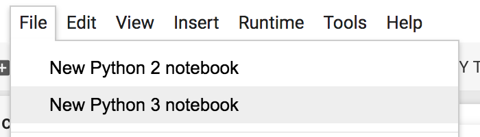

1. Log into your google account
2. Go to https://colab.research.google.com
3. Create an empty notebook
    * 
4. Input `print("hello")` and **run the code** pressing <kbd>⌘</kbd> + <kbd>Enter</kbd>
    * 
5. **Open hotkeys menu** pressing <kbd>⌘</kbd> + <kbd>M</kbd> then <kbd>H</kbd>
    * 
6. Choose the input box for 'Add code cell', press <kbd>⌘</kbd> + <kbd>M</kbd> then <kbd>C</kbd> and choose 'Save'
7. Press <kbd>⌘</kbd> + <kbd>M</kbd> then <kbd>C</kbd>
    * 
8. Input `print("everyone")` and run the code
9. Find a hotkey to 'Delete the cell'
    * Tip: to close the hotkeys window without saving, just press <kbd>Esc</kbd>
10. Delete all cells
11. Using only keys (no mouse or trackpad) make you notebook look as follows:
    * 
12. Configure the following hotkeys:
    * Next cell: <kbd>⌘</kbd> + <kbd>Down</kbd>
    * Previous cell: <kbd>⌘</kbd> + <kbd>Up</kbd>
13. Use two new hotkeys to move up and down between cells
14. Configure the following hotkey:
    * Merge focused cell with next cell: <kbd>⌘</kbd> + <kbd>M</kbd> then <kbd>=</kbd>
15. Go to the first cell and use the new hotkey to merge all cells
16. Execute the single cell that is left
. Delete all cells

**Congratulations, you wrote your first python code in Colab!!!**
